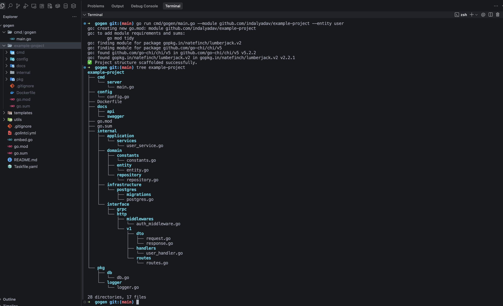

# gogen

A CLI tool that generates Domain-Driven Design (DDD) Golang, chi router service modules with best practices. This tool helps reduce the initial setup time for a new Golang service, allowing developers to focus on writing business logic from the start.

## Installation

```bash
go install github.com/indalyadav56/gogen/cmd/gogen@v1.0.5
```

## Run

```bash
go run cmd/gogen/main.go --module github.com/indalyadav/example-project --entity user
```

## Using binary

```bash
gogen --module github.com/indalyadav/example-project --entity user
```

## screenshots


